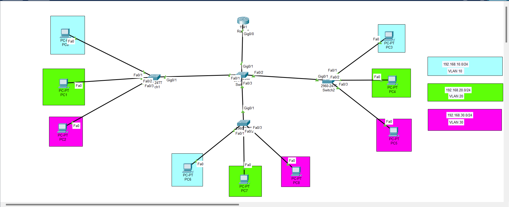

# Inter-Vlan-routing-lab
Cisco Packet Tracer project for Inter-Vlan routing using router-on-a-stick 
# 🚀 Inter-VLAN Routing Lab (Router-on-a-Stick)

Welcome to my *Cisco Packet Tracer Networking Project*!  
This lab demonstrates *Inter-VLAN Routing* using a *Router-on-a-Stick* configuration with multiple switches and VLANs.  

---

## 🎯 Project Objective
- Create *two VLANs* (VLAN 10 & VLAN 20).  
- Configure *Router-on-a-Stick* for inter-VLAN communication.  
- Test connectivity between PCs in different VLANs.  

---

## 🖥 Network Topology

📌 The topology consists of:  
- *1 Router (Cisco 1941)*  
- *2 Switches (Cisco 2960)*  
- *4 PCs across VLANs*  

  
 

---

## 📊 IP Addressing Table

| Device   | Interface       | IP Address       | VLAN |
|----------|-----------------|-----------------|------|
| Router   | Fa0/1.10        | 192.168.10.1    | 10   |
| Router   | Fa0/1.20        | 192.168.20.1    | 20   |
| PC0      | NIC             | 192.168.10.2    | 10   |
| PC1      | NIC             | 192.168.10.3    | 10   |
| PC2      | NIC             | 192.168.20.2    | 20   |
| PC3      | NIC             | 192.168.20.3    | 20   |

---

